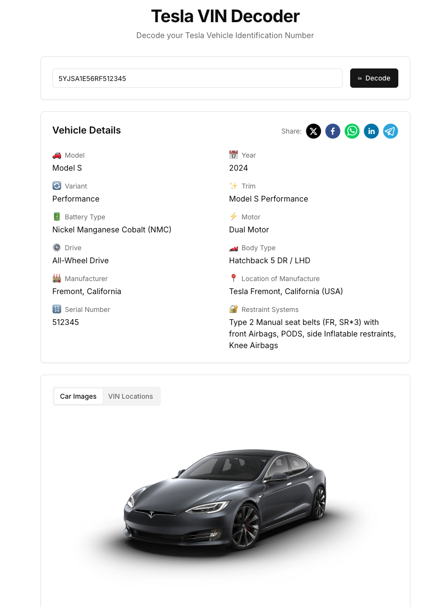

# Tesla VIN Decoder

A web application that allows users to decode Tesla Vehicle Identification Numbers (VINs) to retrieve detailed information about their vehicles, including specifications, images, and more.

## Table of Contents

- [Features](#features)
- [Installation](#installation)
- [Usage](#usage)
- [Contributing](#contributing)
- [License](#license)
- [Disclaimer](#disclaimer)

## Features

- **VIN Decoding**: Enter a Tesla VIN to retrieve detailed specifications.
- **Image Gallery**: View images of the vehicle and VIN locations.
- **Real-time Validation**: Get immediate feedback on VIN validity.
- **User-Friendly Interface**: Simple and intuitive design for easy navigation.

## Installation

To install this project, follow these steps:

1. Clone the repository:
   ```bash
   git clone https://github.com/apirobots/tesla-vin-decoder-app.git
   ```
2. Navigate to the project directory:
   ```bash
   cd tesla-vin-decoder-app
   ```
3. Install the dependencies:
   ```bash
   npm install
   ```
   or
   ```bash
   yarn install
   ```
4. Get API keys for VIN Decoder API https://v2.rapidapi.com/apirobotssquad-apirobotssquad-default/api/tesla-vin-decoder-api-by-apirobots
5. Copy the `.env.example` file and rename it to `.env.local`:
   ```bash
   cp .env.example .env.local
   ```
6. Add your API key to the `.env.local` file:

## Usage

1. Start the development server:
   ```bash
   npm run dev
   ```
   or
   ```bash
   yarn dev
   ```

2. Open your browser and go to `http://localhost:3000`.

3. Enter a Tesla VIN (e.g., `5YJSA1E60MF123456`) in the input box and click the "Decode" button to retrieve vehicle details.

## Screenshots



## Contributing

Contributions are welcome! Please follow these steps to contribute:

1. Fork the repository.
2. Create a new branch:
   ```bash
   git checkout -b feature/YourFeature
   ```
3. Make your changes and commit them:
   ```bash
   git commit -m "Add some feature"
   ```
4. Push to the branch:
   ```bash
   git push origin feature/YourFeature
   ```
5. Open a pull request.

## License

This project is licensed under the MIT License - see the [LICENSE](LICENSE) file for details.

## Disclaimer

Images and trademarks are copyright © Tesla, Inc. All rights reserved.

---

### Acknowledgments

- This project utilizes the Tesla VIN decoding API for retrieving vehicle information.
- Special thanks to the contributors and the open-source community for their support.
